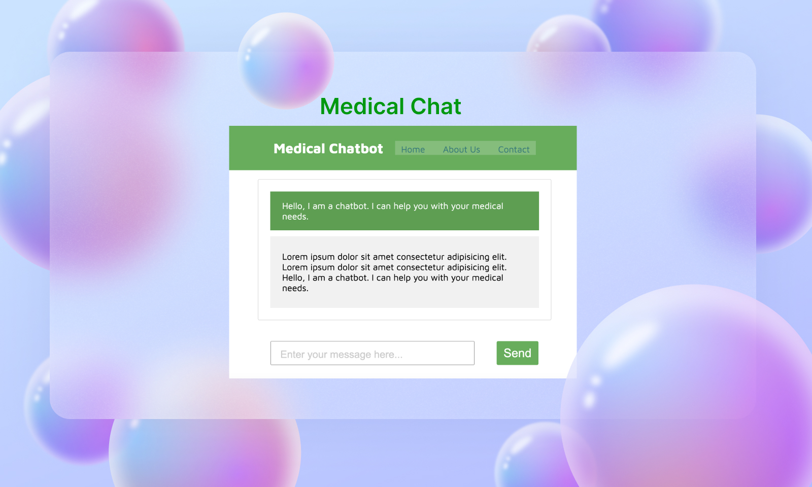

# Avi Cenna Web Application



## Overview

The Avi Cenna Web Application is a user-friendly and interactive platform that hosts the Avi Cenna Medical Chatbot. Avi Cenna is designed to provide medical information, answer health-related queries, and offer guidance in a conversational manner. This README.md file serves as a guide to set up, use, and contribute to the Avi Cenna Web Application.

## Table of Contents

- [Features](#features)
- [Getting Started](#getting-started)
  - [Prerequisites](#prerequisites)
  - [Installation](#installation)
- [Usage](#usage)
- [Contributing](#contributing)
- [License](#license)

## Features

- **Conversational Interface**: Engage in natural language conversations with the Avi Cenna Medical Chatbot.
- **Information Delivery**: Seek medical information, ask questions about symptoms, conditions, and treatment options, and receive accurate responses.
- **Navigation**: Access important sections of the medical website, including the home page, about us, and contact information.
- **User Input**: Input medical queries through a simple text input field and receive real-time responses.
- **Responsive Design**: Enjoy a seamless user experience across different devices and browsers.

## Getting Started

### Prerequisites

Before setting up the Avi Cenna Web Application, ensure you have the following prerequisites:

- Web browser (Google Chrome, Mozilla Firefox, Safari, etc.)
- Internet connection

### Installation

The Avi Cenna Web Application does not require any specific installation steps, as it is hosted on a web server. To access it, simply follow these steps:

1. Open your preferred web browser.

2. Visit the Avi Cenna Web Application URL:

3. You will be directed to the Avi Cenna landing page, where you can interact with the Medical Chatbot and access various sections of the website.

## Usage

Using the Avi Cenna Web Application is straightforward:

1. **Chat with the Chatbot**:
   - Click on the chat window or input field.
   - Type your medical query or message.
   - Press "Enter" or click the "Send" button.
   - The chatbot will provide a response in real-time.

2. **Navigation**:
   - Explore the website by clicking on the navigation links in the header, such as "Home," "About Us," and "Contact."

3. **Mobile Devices**:
   - Avi Cenna is designed to be responsive, so you can use it on your smartphone or tablet with ease.

## Contributing

We welcome contributions to the Avi Cenna Web Application. If you'd like to contribute, please follow these steps:

1. Fork the repository to your GitHub account.

2. Clone the forked repository to your local machine:

   ```
   git clone https://github.com/your-username/avi-cenna-web-app.git
   ```

3. Create a new branch for your feature or bug fix:

   ```
   git checkout -b feature/my-feature
   ```

4. Make your changes, commit them, and push to your GitHub repository:

   ```
   git commit -m "Add my feature"
   git push origin feature/my-feature
   ```

5. Create a pull request from your forked repository to the original repository.

6. Describe your changes and submit the pull request.

We will review your contribution and merge it if it aligns with the project's goals.

## License

The Avi Cenna Web Application is licensed under the [MIT License](LICENSE).

---

Thank you for using the Avi Cenna Web Application! If you have any questions, encounter issues, or want to contribute, please don't hesitate to reach out to us.
